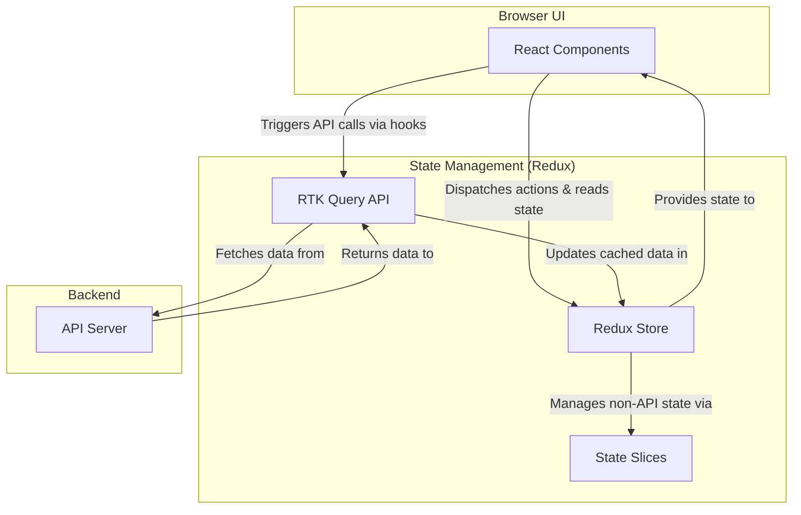

# SmartMilk Frontend

A modern, modular React application for dairy management, device integration, record keeping, and more. This project is part of the SmartMilk system, designed to streamline dairy operations and provide a seamless user experience.

---

## 1. **Table of Contents**
- [Project Purpose & Overview](#1-project-purpose--overview)
- [Technology Stack](#2-technology-stack)
- [High-Level Architecture](#3-high-level-architecture)
- [Folder Structure](#4-folder-structure)
- [Key Features](#5-key-features)
- [Screenshots / Demo](#6-screenshots--demo)
- [Data Flow Example: User Login](#7-data-flow-example-user-login)
- [Getting Started](#getting-started)
- [API / Backend Details](#8-api--backend-details)
- [Deployment](#9-deployment)
- [Contributing](#10-contributing)
- [License](#11-license)
- [Contact / Support](#12-contact--support)

---

## 1. **Project Purpose & Overview**

SmartMilk Frontend is a modern, modular web application built with React. It is designed to manage dairy operations, including user authentication, dairy and device management, record keeping, analytics, and file uploads. The app is part of a larger SmartMilk system, aiming to streamline and digitize dairy business processes.

---

## 2. **Technology Stack**

- **React**: For building the user interface using reusable components.
- **Redux Toolkit & RTK Query**: For state management and efficient data fetching/caching.
- **React Router**: For client-side routing and navigation.
- **Sass (SCSS)**: For modular, maintainable styling.
- **Other**: JavaScript (ES6+), HTML5, CSS3.

---

## 3. **High-Level Architecture**



- **UI Layer**: Built with React components, organized by feature and shared usage.
- **State Management**: Redux store holds global state, with feature-specific slices.
- **API Layer**: RTK Query handles all API requests, caching, and data synchronization.
- **Backend**: Communicates with a backend API for authentication, data storage, and business logic.

---

## 4. **Folder Structure**

```
src/
  ApiUrl/           # API base URLs
  assets/           # Images and static assets
  modules/          # Feature modules (authentication, dairy, device, dashboard, records, settings, uploads)
    pages/            # Main pages for each feature
    store/            # Redux slices and API logic for each feature
    ...Layout.js      # Layout components for each module
  routes/           # Routing configuration
  shared/           # Shared components, hooks, styles, and utilities
    components/       # Common UI elements (Button, Card, Header, SideBar, etc.)
    hooks/            # Custom React hooks
    utils/            # Helper functions and constants
  store/            # Global Redux store configuration
  App.js            # Main app component
  index.js          # Entry point
```

---

## 5. **Key Features**

- **Authentication**: Secure login, user info management, and route protection.
- **Dairy Management**: Add/view dairies, manage dairy-specific data.
- **Device Management**: Add/view devices, device-specific operations.
- **Records**: View and manage device/member records, summaries, and detailed reports.
- **Dashboard**: Analytics and summary views for quick insights.
- **Uploads**: File upload functionality for relevant documents or data.
- **Settings**: User and system configuration options.
- **Responsive UI**: Works well on desktop and mobile devices.
- **Reusable Components**: Shared UI elements for consistency and maintainability.

---

## 6. **Screenshots / Demo**

> Replace these with real images or GIFs as needed.


---

## 7. **Data Flow Example: User Login**

1. **User enters credentials** in the Login page (`Login.js`).
2. **Form submission** triggers a mutation hook from RTK Query (`useLoginMutation`).
3. **API call** is made to the backend via endpoints defined in `authenticateEndPoints.js`.
4. **Backend responds** with user data and token.
5. **Redux store** is updated via `userInfoSlice.js`.
6. **UI updates** to reflect logged-in state; user is redirected to the dashboard.
7. **Protected routes** (via `AuthGuard`) now allow access.

---

## Getting Started

### Prerequisites
- Node.js (v14 or higher recommended)
- npm (v6 or higher)

### Installation
```bash
npm install
```

### Running Locally
```bash
npm start
```
Visit [http://localhost:3000](http://localhost:3000) in your browser.

### Building for Production
```bash
npm run build
```
The production build will be in the `build/` folder.

### Running Tests
```bash
npm test
```

---

## 8. **API / Backend Details**

- API URLs are managed in `src/ApiUrl/` and per-module `store/` directories.
- Each feature module has its own API logic and endpoints.
- RTK Query handles data fetching, caching, and error/loading states.
- Authentication tokens and user info are stored in Redux and/or localStorage.

---

## 9. **Deployment**

- Build the app: `npm run build`
- Deploy the `build/` folder to your preferred static hosting (Vercel, Netlify, AWS S3, etc).
- For custom domains or backend integration, follow your hosting provider's documentation.

---

## 10. **Contributing**

1. Fork the repository.
2. Create a feature branch: `git checkout -b feature/YourFeature`
3. Commit your changes: `git commit -m 'Add some feature'`
4. Push to the branch: `git push origin feature/YourFeature`
5. Open a Pull Request.

---

## 11. **License**

This project is licensed under the MIT License.

---

## 12. **Contact / Support**

- Project Maintainer: [Your Name](mailto:your.email@example.com)
- GitHub Issues: [Open an issue](https://github.com/your-repo/issues)

---

> _Replace placeholder names, emails, and image links with your actual project details as needed._
